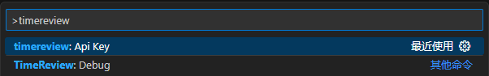

# TimeReview for Visual Studio Code
[中文](README.md) | [English](README-EN.md) 

更多版本请到官方网站 [时间清单](https://todo6.com) 查看和下载，也可以使用接口自定义开发。主要包括：
- vscode
- chrome extension
- desktop app: windows

## Installation

- 1. Press `F1` or `⌘ + Shift + P` and type `install`. Pick `Extensions: Install Extension`.
    
- 2. Type `timereview` and hit `enter`.
    
- 3. Enter your [api key][api key], then press `enter`. get apikey：[https://todo6.com/common/apikey](https://todo6.com/common/apikey)
    > (If you’re not prompted, press `F1` or `⌘ + Shift + P` then type `TimeReview API Key`.)  - 
- 4. Use VSCode and your coding activity will be displayed on your [TimeReview dashboard](https://todo6.com)

## Usage

Visit [https://todo6.com](https://todo6.com) to see your coding activity.

